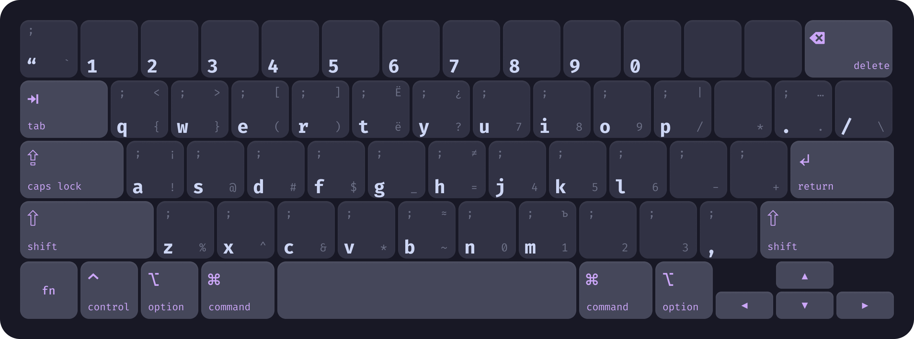
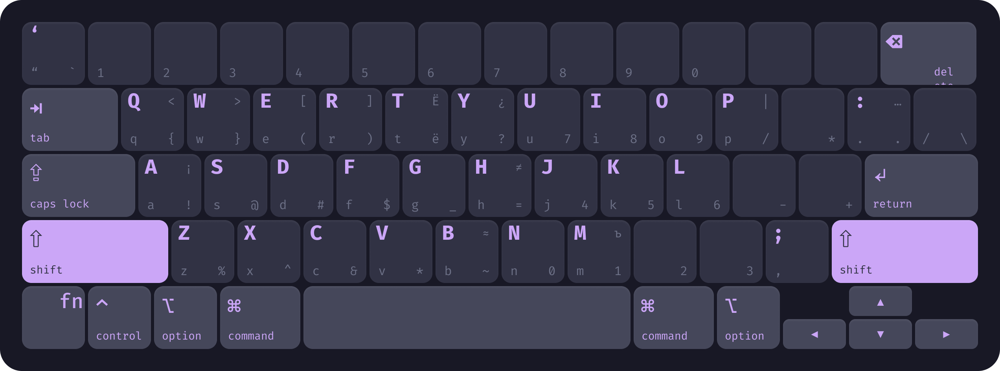
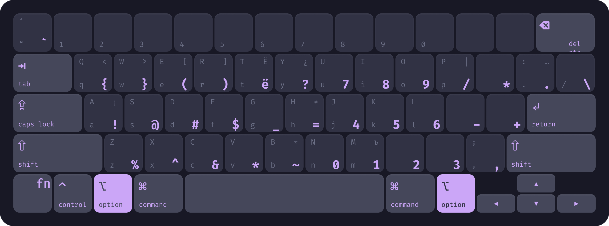
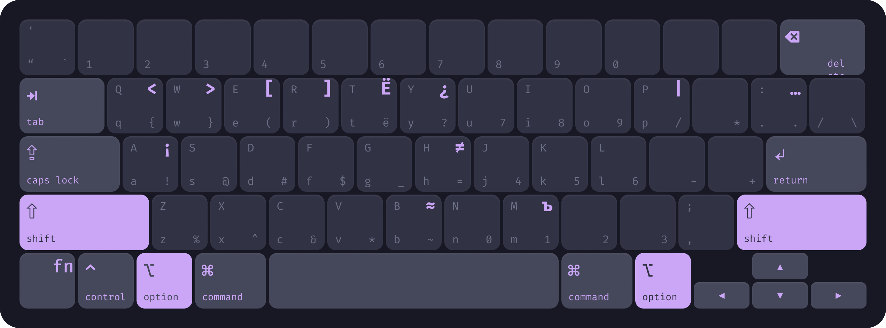
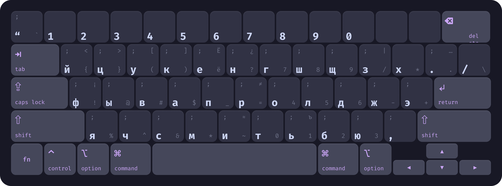

# Alt Layers

## Что это и зачем?

Alt Layers - это попытка приблизить стандартную клавиатуру 
к удобству программирумых клавиатур.

Я долгое время пользуюсь эргономичными, 
программируемыми клавиатурами такими как [Corne](https://github.com/foostan/crkbd)
и [Kabarga](https://github.com/aroum/kabarga)
но порой мне приходится работать за ноутбуком, 
и я не всегда могу брать с собой свои любимые удобные клавитуры,
поэтому мне приходится страдать на стандартной клавиатуре ноута.  
Программируемые клавиатуры удобны тем, что можно создать много слоёв
и располагать клавиши на этих слоях так, как удобно и логично для тебя.

До этого я пользовался ракладкой [Universal-layout](https://github.com/braindefender/universal-layout).  
Для меня это был первый и важный шаг в освоении и понимании кастомных раскладок.

## Слои

Базовый

На этом слое находятся: 

- Буквы `qwerty`;
- Самые частые (для меня) символы, такие как `.,"/`;
- Цифры.

Кавычки и слеш оставил на привычных местах, 
а вот точку с запятой перенёс на мизинец правой руки.

Цифры не хотел оставлять, так как они перенесены в Alt слой и считаю, 
что нужно отвыкать от использования верхнего (четвертого) ряда,
но всё равно на этом ряду находятся бэкспейс и кавычки,
а для игр цифры в этом месте просто необходимы,
поэтому они тут на редкие случаи жизни.

Shift

Тут находятся: 

- Заглавные буквы `qwerty`;
- `:` на месте `.`;
- `;` на месте `,`;
- `'` на месте `"`.

Alt/Option

Это cлой из-за которого всё и создавалось.  
Хоть на картинке не так, но для бOльшего удобства на Macbook, 
я советую поменять местами клавиши `option` и `command`.  
На windows клавиатурах `Alt` и так рядом с пробелом.

Тут "под пальцами" находятся:

- Символы с верхнего ряда `!@#$%^&*`;
- Цифры в формате numpad с математическими операторами `-+/*=`;
- Скобки, которые я чаще всего использую `{}` `()`.
- `ё` на месте `е`.
- `` ` `` на месте `"`
- `\` на месте `/`
- `?`
- `_`
- `~`

Символы расположил в том же порядке, что и на стандартной раскладке, 
просто с 5-ого по 8-ый сместил на нижний ряд.  
Точка и запятая находятся на том же месте, как и на базовом слое.

### !!!ВНИМАНИЕ!!!
На windows, для активации слоя, не достаточно зажать левый `Alt`, нужно нажать `LCtrl+LAlt`.  
`RAlt` зажимается без `RCtrl`, он в раскладке распознаётся как `AltGr` (Alternate Graphic).

Alt/Option+Shift

Тут находятся:

- Оставшиеся скобки `<>` `[]`;
- `ъ` на месте `ь`;
- `Ё` на месте `е`;
- Совсем уж экзотичные символы.

Я хотел разместить `ъ` на "Alt слой" на ту же клавишу с `ь`, 
но там находятся цифры numpad.  
Так же тут находится `Ë` так как 
`Alt+е -> ё`, а 
`Alt+Shift+е -> Ë`, 
логика шифта сохраняется.

Caps Lock

Это по сути базовый слой только для `йцукен`.  
На нём находятся те же символы как на базовом и на тех же местах.  
Остальные слои с ним работают так же как с базовым.

Зачем это нужно? Почему не создать отдельную раскладку для `йцукен`?  

- В два раза меньше работы - изменений;
- В два раза меньше раскладок устанавливать на комп;
- Переключение языка удобнее (ИМХО).

## Установка

### Mac

- Скачать [AltLayers.bundle](https://github.com/PavelAltynnikov/AltLayers/releases);
- Положить в папку `~/Library/Keyboard Layouts/`
- Добавить раскладку в
    - Настройки
    - Клавиатура
    - Ввод текста
    - Источники ввода
    - Изменить...
    - `+`
    - Английский
    - qwerty_icuken_upd`

### Windows

- Скачать [qwecuken.zip](https://github.com/PavelAltynnikov/AltLayers/releases);
- Запустить `setup.exe`;
- Перезагрузить комп!
- В выборе раскладки появится `Английский (Новая Зеландия) Updated qwerty and icuken layouts`

## Проблемы и их решения

### Mac

На Mac OS проблем замечено не было.

### Windows

#### Конфликт хоткеев 

Различные программы устанавливают свои хоткеи и если этот хоткей содержит в себе
`Ctrl+Alt+<клавиша>`, то данный хоткей будет перехватывать работу `Alt` слоя.
Чтобы понять какая программа перехватывает сочетание клавиш, 
можно воспользоваться программой 
[Hotkey Detective](https://github.com/ITachiLab/hotkey-detective)

У меня некоторые сочетания перехватывались Nvidia App, а именно:

- `Ctrl+Alt+m`. 
    Это решилось просто, в Оверлей/Настройки/"Сочетания клавиш" нашёл и удалил 
    это сочетание (можно было изменить, но эта функция мне не нужна).
- `Ctrl+Alt+r`.
    А вот это я долго искал и так не понял как исправил.
    Этy комбинацию я смог найти только через ранее упомянутую утилиту,
    искал где она назначена, облазил весь Nvidia app, не нашёл, но проблема ушла.
    Так же эту проблему можно исправить просто отключив Оверлей.

#### Windows Terminal

Проблема тут заключается во взаимодействии "Caps Lock" слоя и терминала.
Так как на базовом слое есть пустые клавиши, 
то терминал их не воспринимает при включенном капслоке,
следовательно русские буквы не будут печататься.

Это можно починить несколькими способами:

- На базовом слое, на пустые места добавить значения;
- Поменять местами Ru и En языки в раскладке;
- Сделать Issue в windows terminal.

Пока не знаю какой способ выбрать.

## Редактирование

### Mac
Для редактирования раскладки нужна программа [Ukelele](https://software.sil.org/ru/ukelele/).  
Можно поставить при помощи brew `brew install --cask ukelele`.

### Windows
Для редактирования раскладки нужна программа [Microsoft Keyboard Layout Creator](https://www.microsoft.com/en-us/download/details.aspx?id=102134).  
Для этой программы важно наличие .Net Framework 3.5. На windows 11 его можно установить вот таким [способом](https://learn.microsoft.com/ru-ru/dotnet/framework/install/dotnet-35-windows-11).

## Что еще можно улучшить?

Если вам понравилась данное небольшое улучшение 
и вам хочется еще чуть улучшить взаимодействие с клавиатурой,
но при этом вы всё еще не готовы переходить на программируемые клавиатуры,
то можно использовать концепцию [Home row mods](https://precondition.github.io/home-row-mods).

На Mac OS её можно реализовать с помощью Karabiner.  
На windows пока не знаю как это сделать.

Так же есть более удобная возможность перейти на другую раскладку, например 
с [qwerty](https://en.wikipedia.org/wiki/QWERTY) 
на [colemak](https://en.wikipedia.org/wiki/Colemak), 
так как это заденет только базовый слой этого языка, 
а все остальные слои останутся такими же 
и не нужно будет снова учить где какие символы на новой раскладке
